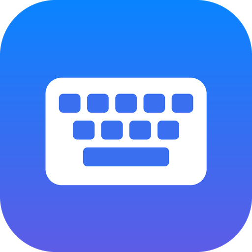
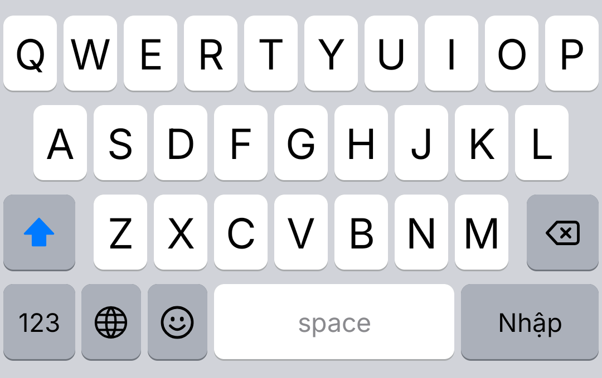
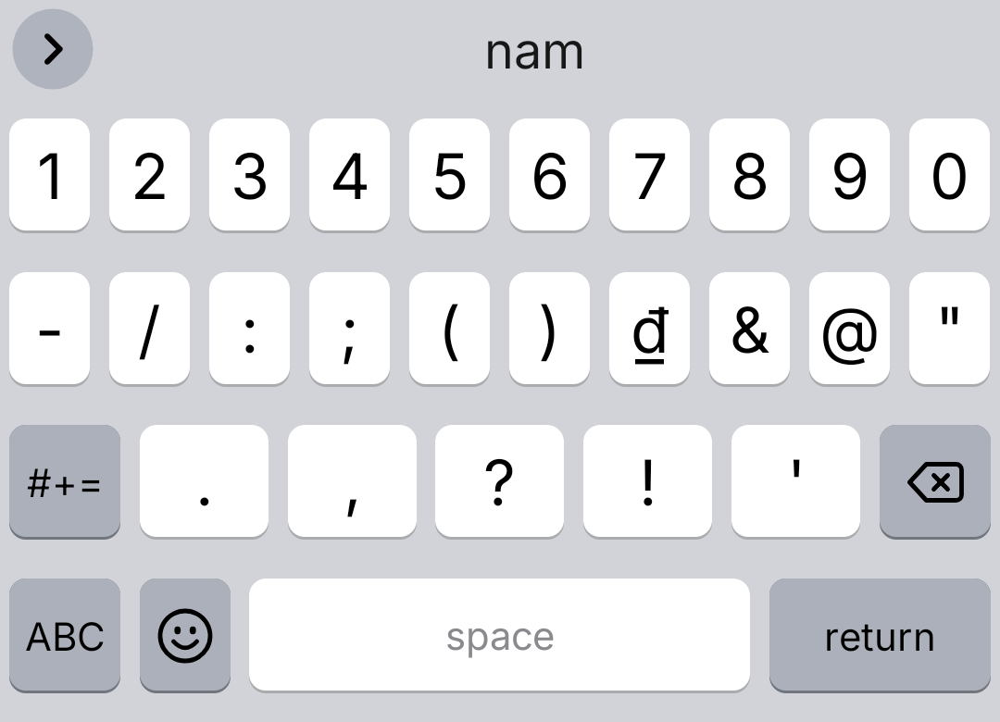
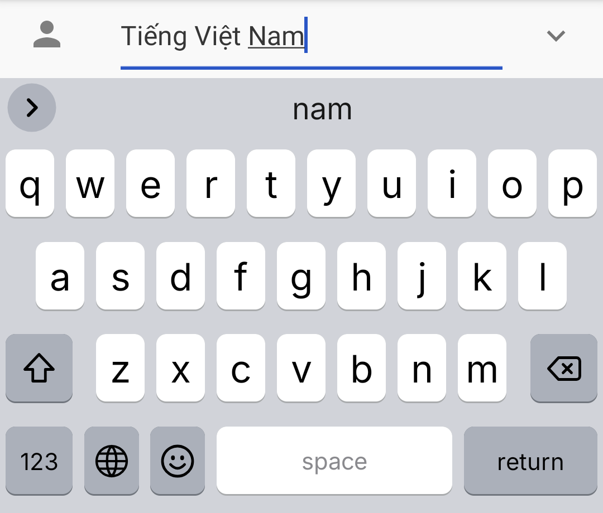
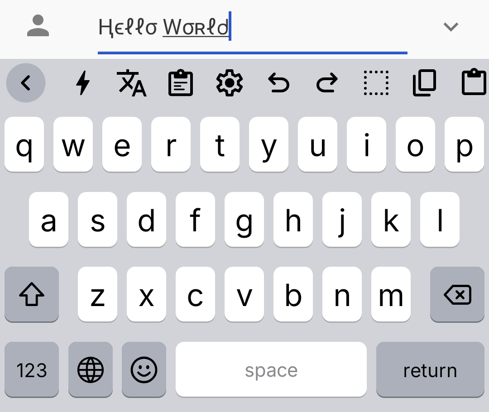
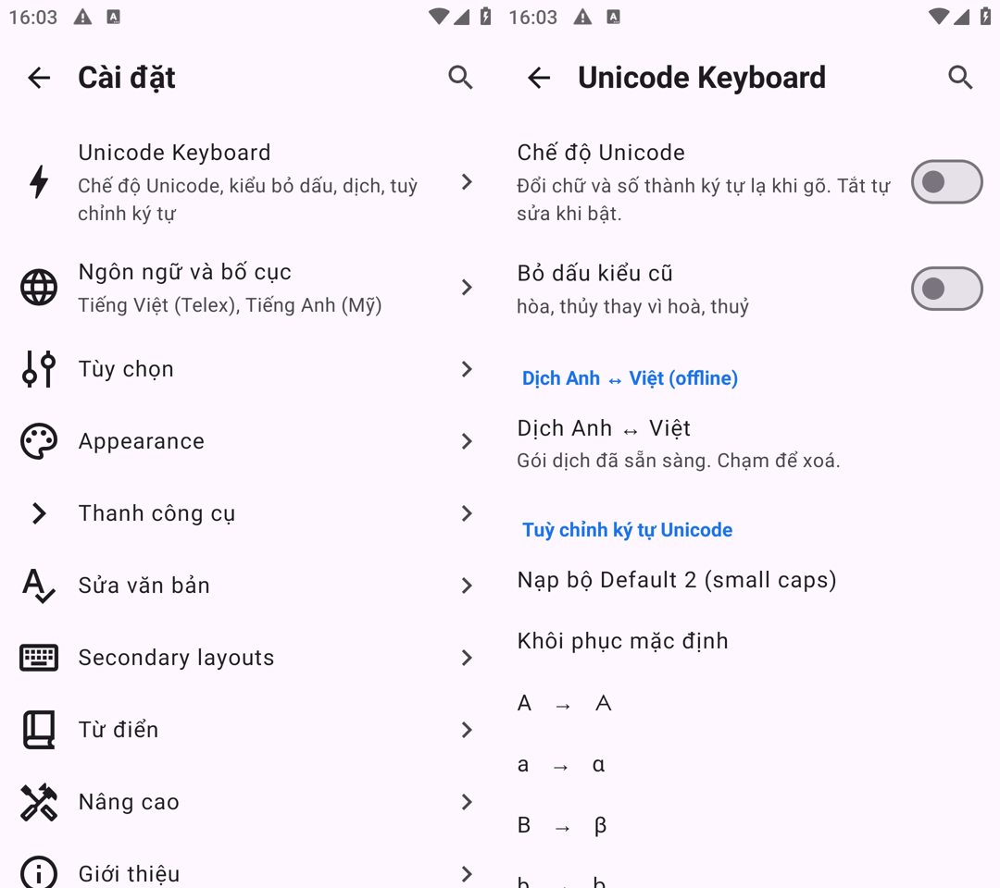

<p align="center">
  
</p>

<h1 align="center">Unicode Keyboard</h1>

<p align="center">
  An iOS-style Android keyboard for English and Vietnamese, with Telex typing,<br>
  a look-alike Unicode character mode and offline English ↔ Vietnamese translation.
</p>

<p align="center">
  <a href="https://github.com/hieuday88/UnicodeKeyboard/releases/latest"><b>Download the latest APK</b></a>
</p>

<p align="center">
  
  
</p>

## Features

### iOS look and feel
- iOS layouts: `123 · 😀 · space · return` bottom row, iOS-style 123 and #+= pages
- iOS-style bar below the keys with the 🌐 language switch and a 🎤 voice input button (shown when a voice service is available)
- iOS light and dark themes that follow the system, rounded keys with a subtle bottom shadow
- iOS-like icons (shift, caps lock, delete, emoji, globe) drawn from scratch, and the Inter font
- Key pop-up preview, haptic feedback, double-space period, auto-capitalization
- Long-press for accents (`a` → `à á ả ã ạ ă â …`), swipe on space to move the cursor,
  swipe on delete to select text
- The interface is in English by default and follows the phone language
  (a Vietnamese translation is included)

### Vietnamese Telex



- Built-in **Vietnamese (Telex)** layout; English and Vietnamese are enabled by default,
  switch with the 🌐 button below the keys
- `tieengs vieetj` → `tiếng việt`, `dduwowcj` → `được`, `nguwowif` → `người`
- Repeat a key to undo it: `ass` → `as`, `caaa` → `caa`
- Choose the tone placement: new style (`hoà`, `thuỷ`) or old style (`hòa`, `thủy`)
- Automatically turned off in password, email and URL fields

<br clear="right">

### Unicode mode



- Types look-alike Unicode characters instead of letters and digits:
  `hello world` → `Ңϵℓℓσ Ԝσʀℓᑯ`
- Toggle it with the ⚡ button on the toolbar (off by default);
  auto-correction is paused while it is on
- Customize every character: pick from a catalog of variants, enter any text,
  load the "Default 2" preset (small caps) or reset to defaults

<br clear="right">

### Offline translation
- The 文A button on the toolbar translates the selected text, or all text before the cursor, and replaces it
- The direction is detected automatically: text with Vietnamese letters is translated to English,
  anything else to Vietnamese
- Runs on the device with Google ML Kit; the models (~30 MB) are downloaded on first use
  and can be removed in settings

### Inherited from HeliBoard
Word suggestions and auto-correction, clipboard history, emoji palette, one-handed and split modes,
custom layouts and colors, backup and restore. No ads, no tracking.

## Installation

1. Download `UnicodeKeyboard_<version>-release.apk` from the [releases page](https://github.com/hieuday88/UnicodeKeyboard/releases)
   and install it (Android 5.0 or newer).
2. Open **Unicode Keyboard** and follow the setup steps to enable it and select it as your keyboard.
3. Add or remove languages under **Languages & Layouts**.

## Settings

<p align="center">
  
</p>

Open the app, or tap ⚙ on the keyboard toolbar, then **Unicode Keyboard**:

| Setting | Description |
|---|---|
| Unicode mode | Same as the ⚡ toolbar button |
| Old tone style | `hòa` instead of `hoà` |
| Translate EN ↔ VI | Download or delete the offline translation models |
| Unicode character customization | Choose a replacement for each character, load "Default 2" or reset |

The toolbar (the `>` button above the keys) holds Unicode mode, translation, clipboard, settings,
undo/redo and text editing shortcuts. Its content can be changed under **Toolbar**.

A different font can be used under **Appearance → Custom font**.

## Building from source

Requirements: JDK 17 or newer (the JBR bundled with Android Studio works) and the Android SDK.
Gradle downloads the missing SDK platform (compileSdk 37) and NDK automatically.

```sh
./gradlew assembleDebugNoMinify   # quick debug build
./gradlew assembleRelease         # minified release build
./gradlew testDebugUnitTest --tests "helium314.keyboard.unicode.*"   # Telex tests
```

The APKs are written to `app/build/outputs/apk/<variant>/UnicodeKeyboard_<version>-<variant>.apk`.

### Signing release builds
`assembleRelease` signs the APK when a `signing/keystore.properties` file exists **next to** the repository folder
(`../signing/keystore.properties`):

```properties
storeFile=unicode-keyboard-release.jks
storePassword=...
keyAlias=unicodekeyboard
keyPassword=...
```

Never commit the keystore, and keep a backup: every update must be signed with the same key.

## Project structure

| Path | Content |
|---|---|
| `app/src/main/java/helium314/keyboard/unicode/` | Telex engine, Unicode mode engine, character catalog, translator |
| `app/src/main/java/helium314/keyboard/event/TelexCombiner.kt` | Connects Telex to the input pipeline |
| `app/src/main/java/helium314/keyboard/settings/screens/UnicodeKeyboardScreen.kt` | Unicode Keyboard settings screen |
| `app/src/main/assets/layouts/` | iOS-style bottom row and symbol layouts |
| `app/src/main/res/values/unicode_keyboard_strings.xml` | English strings (Vietnamese in `values-vi/`) |
| `app/src/test/java/helium314/keyboard/unicode/` | Telex unit tests |

## License

Unicode Keyboard is released under the [GNU General Public License v3.0](LICENSE), like HeliBoard.
Code inherited from AOSP is licensed under the [Apache License 2.0](LICENSE-Apache-2.0).

The bundled [Inter](https://github.com/rsms/inter) font is licensed under the
[SIL Open Font License 1.1](INTER_FONT_LICENSE.txt).
Apple's SF fonts and SF Symbols are **not** included; the iOS-like icons are original vector drawings.

## Credits

- [HeliBoard](https://github.com/HeliBorg/HeliBoard) and its contributors,
  [OpenBoard](https://github.com/openboard-team/openboard) and the AOSP keyboard
- [Inter](https://rsms.me/inter/) by Rasmus Andersson
- [Google ML Kit](https://developers.google.com/ml-kit/language/translation) for on-device translation
