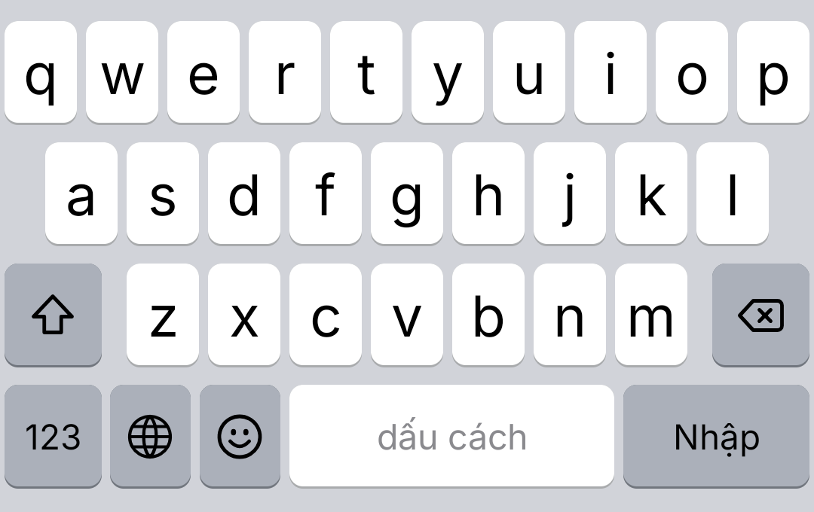

<p align="center">
  
</p>

# Unicode Keyboard

An iOS-style Android keyboard for Vietnamese and English, with built-in Telex typing, a look-alike
"Unicode" character mode and offline English ↔ Vietnamese translation.

It is a fork of [HeliBoard](https://github.com/HeliBorg/HeliBoard) (itself based on AOSP / OpenBoard) and the
successor of the CMkey keyboard.

<p align="center">
  
  
</p>

## Features

### Vietnamese Telex
- "Tiếng Việt (Telex)" layout: `tieengs vieetj` → `tiếng việt`, `dduwowcj` → `được`, `nguwowif` → `người`
- Double a tone or hook key to undo it (`ass` → `as`, `caaa` → `caa`)
- Tone placement option: new style (`hoà`, `thuỷ`) or old style (`hòa`, `thủy`)
- Automatically disabled in password, email and URL fields
- Vietnamese and English layouts are enabled by default; switch with the 🌐 key

### Unicode mode
- Replaces letters and digits with look-alike Unicode characters while you type
  (`hello` → `ҥϵℓℓσ`), handy for game names and chats
- Toggle with the ⚡ button on the toolbar (off by default); auto-correction is paused while it is on
- Per-character customization with a catalog of variants for every letter, a free-text override,
  a "Default 2" preset (small caps) and a reset button

### Offline translation
- 文A button on the toolbar translates the selection, or all text before the cursor, and replaces it
- Direction is detected automatically: text with Vietnamese letters is translated to English,
  anything else to Vietnamese
- Uses on-device Google ML Kit models (~30 MB, downloaded on first use; manage them in settings)

### iOS look and feel
- iOS layouts: `123 · 🌐 · 😀 · space · return` bottom row, iOS 123 and #+= symbol pages
- iOS light and dark themes that follow the system, rounded keys with a bottom shadow
- Self-drawn iOS-like icons (shift, caps lock, delete, emoji, globe) and the Inter font
- Space label "dấu cách" / "space" depending on the layout, "Nhập" return key
- Key pop-up preview, haptic feedback, double-space period, auto-capitalization,
  long-press accents (`a` → `à á ả ã ạ ă â…`), swipe on space to move the cursor, swipe on delete to select

### Inherited from HeliBoard
Suggestions and auto-correction with dictionaries, clipboard history, emoji palette, one-handed and split
modes, custom layouts and colors, backup and restore, no ads and no tracking.

<p align="center">
  
</p>

## Settings

Open the app (or ⚙ on the keyboard toolbar) → **Unicode Keyboard**:

| Setting | Description |
|---|---|
| Unicode mode | Same as the ⚡ toolbar button |
| Old tone style | `hòa` instead of `hoà` |
| Translate EN ↔ VI | Download or delete the offline translation models |
| Unicode character customization | Pick a variant for each character, load "Default 2" or reset |

A custom font (for example a font you own) can be selected under **Appearance → Custom font**.

## Build

Requirements: JDK 17+ (the JBR bundled with Android Studio works) and the Android SDK
(compileSdk 37, NDK 28 — Gradle downloads missing components).

```sh
./gradlew assembleDebugNoMinify   # fast debug build
./gradlew assembleRelease         # minified release build
./gradlew testDebugUnitTest --tests "helium314.keyboard.unicode.*"
```

APKs are written to `app/build/outputs/apk/<variant>/UnicodeKeyboard_<version>-<variant>.apk`.

### Release signing
`assembleRelease` signs the APK when `../signing/keystore.properties` exists next to the repository folder:

```properties
storeFile=unicode-keyboard-release.jks
storePassword=...
keyAlias=unicodekeyboard
keyPassword=...
```

Keep the keystore out of the repository and back it up: updates must be signed with the same key.

## Project layout

| Path | Content |
|---|---|
| `app/src/main/java/helium314/keyboard/unicode/` | Telex engine, Unicode mode engine, character catalog, translator |
| `app/src/main/java/helium314/keyboard/event/TelexCombiner.kt` | Hooks Telex into the input pipeline |
| `app/src/main/java/helium314/keyboard/settings/screens/UnicodeKeyboardScreen.kt` | Unicode Keyboard settings screen |
| `app/src/main/assets/layouts/` | iOS-style functional and symbol layouts |
| `app/src/test/java/helium314/keyboard/unicode/` | Telex unit tests |

## License

Unicode Keyboard is licensed under the [GNU General Public License v3.0](LICENSE), like HeliBoard.
Parts inherited from AOSP are under the [Apache License 2.0](LICENSE-Apache-2.0).

The bundled [Inter](https://github.com/rsms/inter) font is licensed under the
[SIL Open Font License 1.1](INTER_FONT_LICENSE.txt).
Apple's SF fonts and SF Symbols are **not** included; the iOS-like icons are original vector drawings.

## Credits

- [HeliBoard](https://github.com/HeliBorg/HeliBoard) and its contributors, [OpenBoard](https://github.com/openboard-team/openboard) and AOSP
- [Inter](https://rsms.me/inter/) by Rasmus Andersson
- [Google ML Kit](https://developers.google.com/ml-kit/language/translation) for on-device translation
